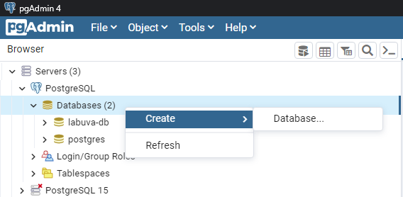

# projeto-lab-uva

# Descrição do projeto
O projeto é um sistema web de lista de trabalhos escolares ou acadêmicos. A ideia é que o aluno faça um cadastro e seja capaz de criar uma listas com seus afazeres adicionando nome, prazo de entrega, grau de importância, descrição do que deve ser feito. E através de notificações via push notification, o aluno receberá lembretes 30 dias, 1 semana e 1 dia antes de terminar o prazo programado. A ideia é centralizar os trabalhos da faculdade num só lugar e facilitar o aluno para que ele não esqueça de nenhum trabalho e tenha tudo organizado em um só lugar.

# Como instalar e rodar o projeto
Para o projeto funcionar, precisa-se ter instalado o banco de dados Postgres e 
criar um banco chamado 'labuva-db' com senha = '12345678'.

## Backend
- Java 11
- postgres (PG admin 4)
- Postman
- Spring boot
- Maven

## Frontend
- ReactJS
- Typescript
- Styled-components
- Axios
